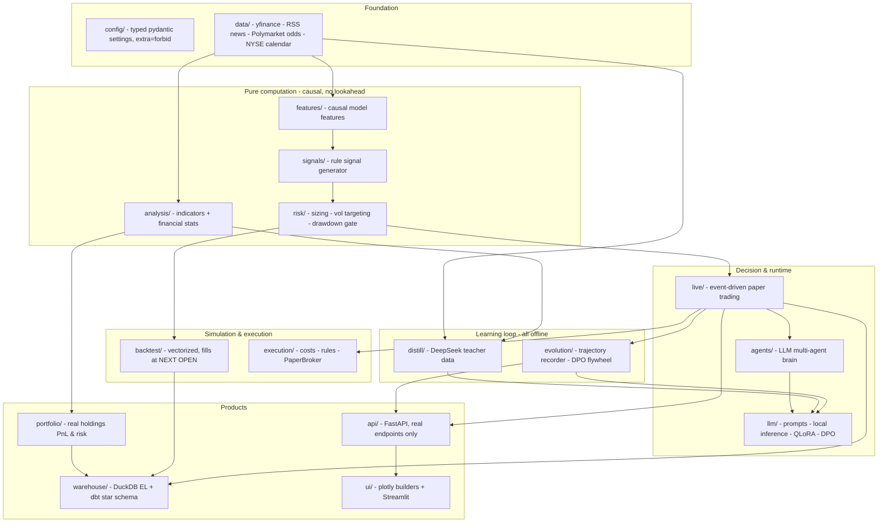
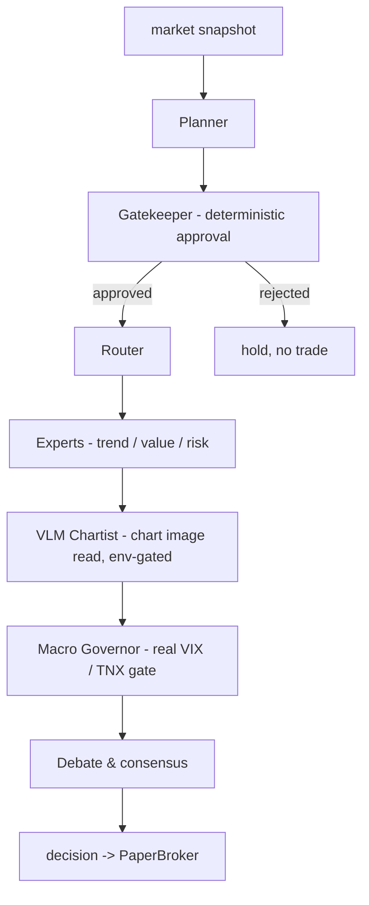
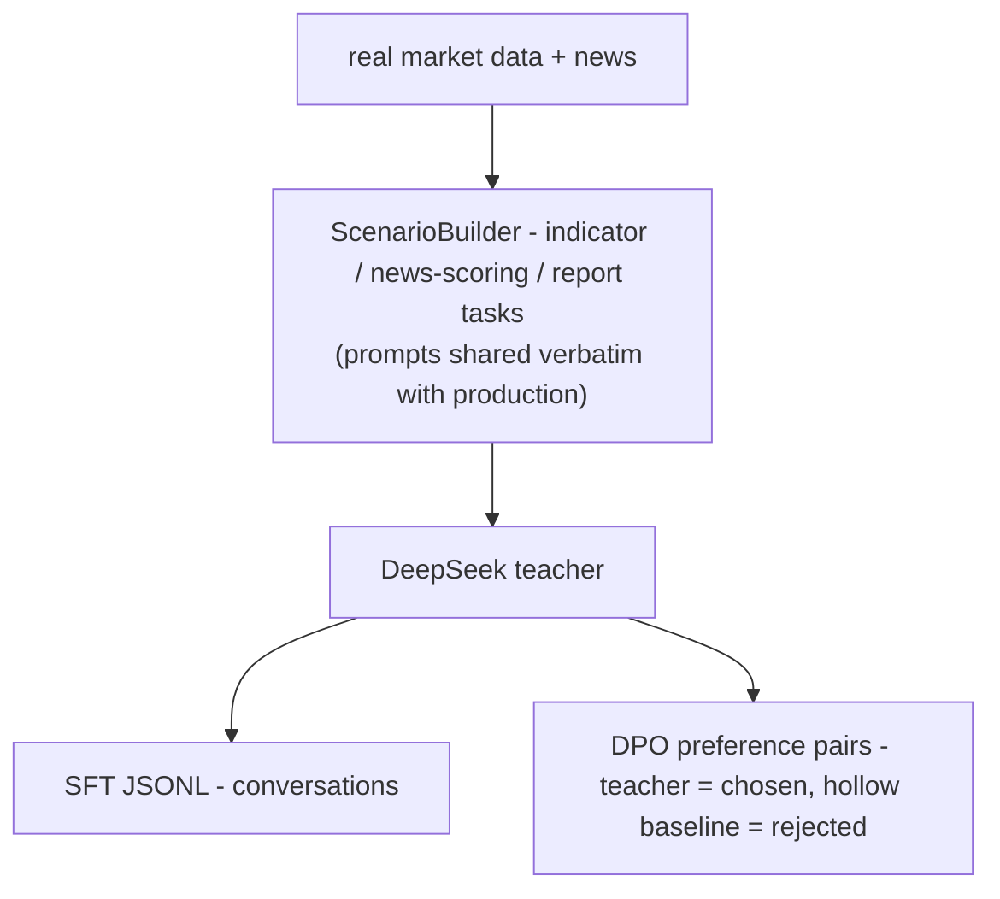
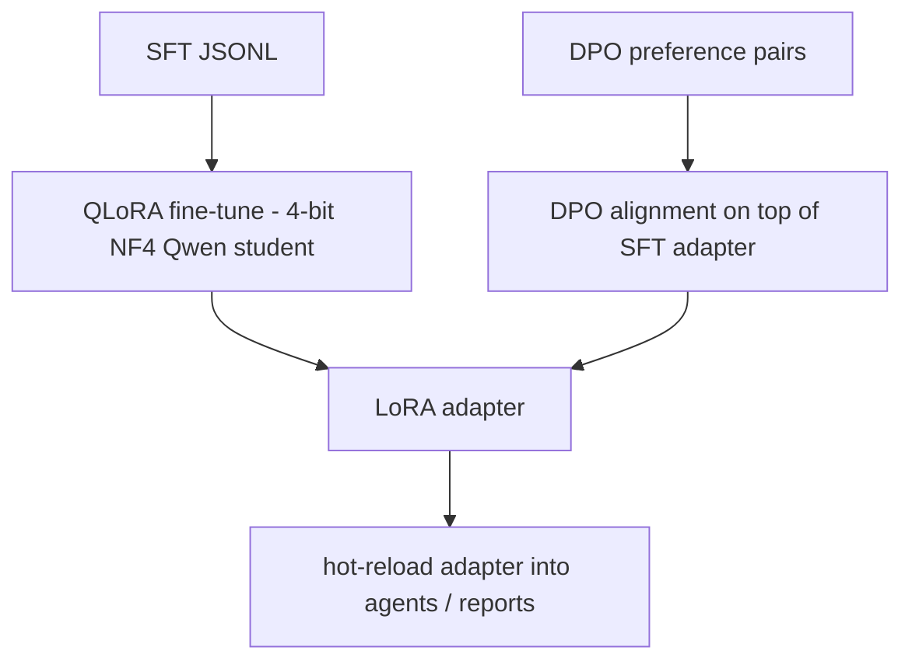
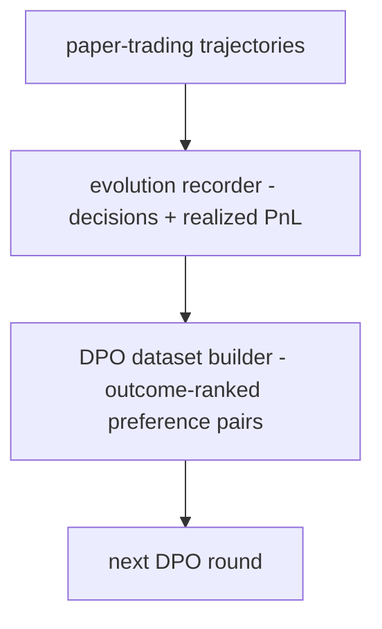
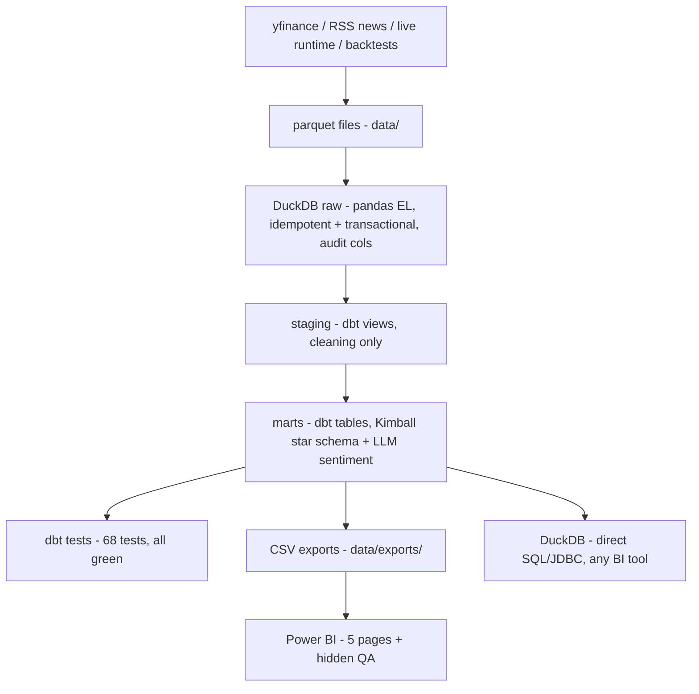
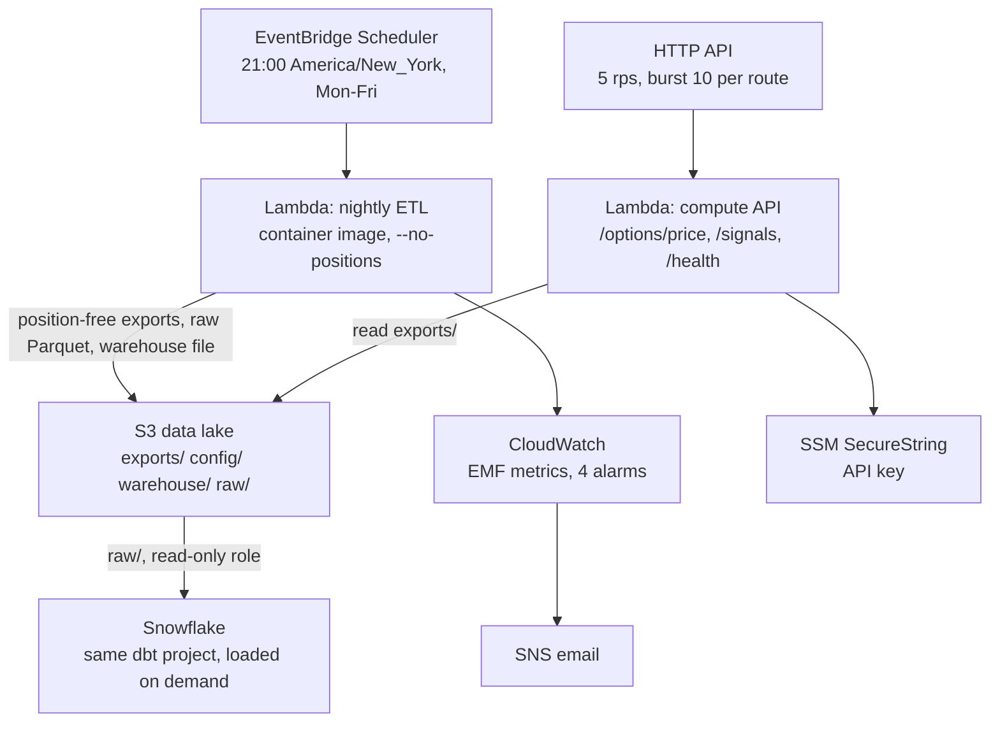
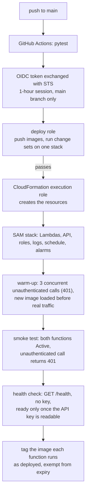
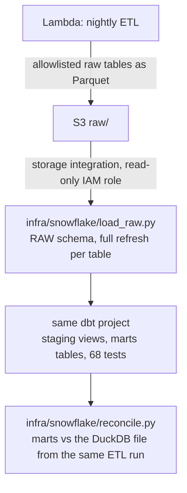

#  QuantAI - Personal Portfolio Analysis & Decision-Support System

**A personal quant workbench in two surfaces: a real-time trading console with a
local-LLM analyst (Streamlit - the product anyone can clone and run), backed by a
reconciled offline BI artifact (Power BI over a DuckDB/dbt star schema).**
US equities (NYSE calendar), typed and tested (795 tests), honest by design. The nightly ETL and a small
compute API run on AWS Lambda, deployed by GitHub Actions over OIDC
([details](#cloud-deployment-aws)), and the same dbt project also builds on Snowflake from the S3 lake
([details](#snowflake-same-dbt-project-second-engine)).

| Frontend - live workstation (Streamlit) | Power BI - offline analysis artifact |
|---|---|
|  |  |
|  |  |

*Frontend screenshots use the bundled `portfolio.example.yaml` - no real holdings shown.*

-> [Quick start](#quick-start) - [Two surfaces, one warehouse](#two-surfaces-one-warehouse) - [Architecture](#architecture) - [Cloud deployment](#cloud-deployment-aws) - [Snowflake](#snowflake-same-dbt-project-second-engine)

The codebase was rebuilt bottom-up into the typed, tested `quantai/` package;
the pre-rebuild tree is kept out of the repository entirely.

---

## What it does

Four jobs, nothing decorative:

1. **Analyze your real portfolio** - load actual holdings (local YAML/CSV, never
   committed), compute precise unrealized PnL, exposure/concentration, beta,
   holdings-based risk stats, and per-position technical state.
2. **Track tickers & markets** - a pure pandas/numpy indicator & stats engine with
   math definitions, boundary honesty, and causality proofs (no lookahead); a
   self-managed watchlist feeding prices, signals, and RSS news into the warehouse;
   a broker-style workstation UI (bilingual zh/en chrome, auto-refreshing intraday
   1-minute bars, VWAP, indicator toggles) with a real-position banner and an
   always-on **tactics board**: a five-factor rule engine emits per-symbol action
   cards (add/hold/trim/exit + stop references) every 30s, while a resident
   analyst - the local v3 student, or any OpenAI-compatible remote API via
   `llm.remote` - runs a background daemon thread that summarizes the board and
   persists news sentiment every 5 minutes without ever blocking the UI. A
   **hedging desk** prices option protection deterministically (Black-Scholes
   engine + Greeks + implied-vol solver, tested against textbook values):
   protective-put and covered-call cards with premium %, locked max-drawdown,
   annualized income and honest odd-lot disclosure - the LLM only narrates
   numbers the engine computed, never does option math itself.
3. **AI analyst** - scheduled daily and intraday reports: session statistics with
   honest OHLCV-level selling-pressure proxies (down-bar volume share, price vs
   session VWAP, volume vs 20-day average), LLM commentary from a locally served
   Qwen model grounded strictly in system data, and batch **news-sentiment
   quantification** persisted to the warehouse for BI timelines.
4. **Decision support & learning loop** - rule + LLM multi-agent pipeline (planner ->
   gatekeeper -> router -> experts -> VLM chartist -> macro governor -> debate),
   paper-trading runtime, and an executed **teacher-student distillation flywheel**:
   DeepSeek-generated scenario batches (indicator analysis, news scoring,
   multi-symbol reports - prompts shared verbatim with production) -> local
   QLoRA SFT / DPO on a single RTX 4090. The **v3 student is live**: 7,308
   teacher samples spanning 50 historical dates (bull/bear/chop coverage) plus a
   dedicated **options curriculum** - premium selling, buy-vs-sell timing,
   0-7-day ("0DTE") risk discipline and hedge-plan review, every prompt fed
   real option chains and engine-computed Greeks so the student learns to cite
   and judge, never to compute. Trained overnight at seq 2560 (5.5 h,
   eval-loss 0.794; the max-seq ladder and VRAM-baseline gate live in
   `scripts/night_train_v3.py`), passed the blind-eval gate - zero repetition
   collapse across 26 cases, complete three-section structure on held-out option
   symbols never seen in training, and roughly double the base model's
   prompt-number citations on fresh symbols - and now serves as the production
   analyst adapter (v1 was rejected by the same gate and never shipped; v2
   served before v3 replaced it). On top of the batch flywheel, a scheduled
   **daily decision journal** accumulates triple-labeled samples every trading day:
   a transparent rule engine states the day's position call (citing real indicator
   values) -> the teacher independently answers the same scenario (clean SFT data)
   and grades the system's call 0-10 (preference signal; low-scoring calls become
   DPO rejected samples) -> realized 5/20-day forward returns are backfilled once
   the market plays out (ground truth for outcome-ranked DPO, never in prompts).

## Two surfaces, one warehouse

The two UIs are **not substitutes** - they answer different questions off the
same tested computation layer:

- **Streamlit frontend = the product surface.** Real-time and interactive:
  intraday workstation (1-minute bars, tactics board, hedging desk), resident
  AI analyst reports, paper-trading session console, portfolio & watchlist,
  parameterized YTD replay. **This is what runs when a stranger clones the
  repo** - quickstart below, only the example YAMLs needed.
- **Power BI = the offline analysis artifact.** Six reconciled pages (signals
  heatmap, rolling volatility, backtest deep-dive, return distribution, news &
  event odds, hidden QA) built on the exported star schema with a 67-check
  DAX-vs-pandas reconciliation. **It is a batch snapshot by design** - all
  partitions import local CSVs produced by `python scripts/warehouse.py
  --export`; it does not and cannot sync live quotes (DirectQuery doesn't
  support CSV; scheduled Service refresh needs a paid license). Free Desktop
  also means **no shareable online link**: the deliverable is the `.pbip`
  project in [`powerbi/`](powerbi/README.md) plus committed screenshots; to
  interact you open it locally in Power BI Desktop (Windows).

Data flow: live quotes/news -> frontend directly; the same fetchers -> DuckDB ->
dbt star schema -> CSV exports -> Power BI. Unique to the frontend: real-time
anything, LLM interaction, order/paper-trading control. Unique to Power BI:
cross-filtered exploration of the full history at once, conditional-format
heatmaps, and a reconciliation page that proves the numbers.

## Quick start

Requires Python 3.11+ on Windows/macOS/Linux (Power BI artifact is
Windows-only to *view interactively*; everything else is cross-platform).

```powershell
git clone https://github.com/C0k11/quantai.git && cd quantai
python -m venv venv && venv\Scripts\activate          # or source venv/bin/activate
pip install -e .[ui,warehouse,serve,dev]               # add [llm] for the local-GPU analyst
copy portfolio.example.yaml portfolio.local.yaml       # fill in your holdings (never committed)
copy watchlist.example.yaml watchlist.local.yaml
```

```powershell
# 0) All tests (fastest proof everything runs)
python -m pytest

# 1) Analyze your real portfolio (copy portfolio.example.yaml -> portfolio.local.yaml first)
python scripts/analyze.py                      # text report; --json for machines

# 2) Data warehouse: ETL -> dbt star schema -> BI exports (CSV)
python scripts/warehouse.py --full --portfolio portfolio.local.yaml

# 3) Dashboard (portfolio page works standalone)
quantai-dashboard                              # or: python -m streamlit run quantai/ui/streamlit_app.py

# 4) AI analyst reports (data brief is seconds; --llm adds local-GPU commentary + news scoring)
python scripts/report.py --llm              # daily
python scripts/report.py --intraday --llm   # intraday session stats + selling-pressure proxies

# 5) Paper trading (offline deterministic demo)
python scripts/live.py --source simulated --tickers NVDA TSLA --interval 0.1 --duration 8 --seed 1

# 6) Distillation flywheel (mock dry-run is free; real teacher runs are cost-gated)
python scripts/distill.py --dry-run --symbols SPY NVDA
python scripts/train.py --sft data/distill/<batch>.jsonl --confirm-compute

# 7) Daily decision journal (rule engine call -> teacher answer + 0-10 grade -> training asset;
#    idempotent per scenario, outcome returns backfilled as they mature)
python scripts/journal.py --dry-run --symbols SPY NVDA
python scripts/journal.py --backfill-outcomes --export-sft data/distill/journal_sft.jsonl
```

## Architecture



### Multi-agent decision chain



Every LLM stage has a deterministic fallback, so the chain runs end-to-end
offline (CPU-only, no keys) and stays testable.

### Teacher-student distillation & evolution flywheel (offline by design)

**Stage 1 - Distillation** (cost-gated: real teacher calls require
`--run --confirm-spend`, key from env only):



**Stage 2 - Student training** (local RTX 4090, `--confirm-compute` gated):



**Stage 3 - Evolution flywheel** (paper-trading experience feeds the next round):



> **Honest boundary:** there are NO online gradient updates - all learning is
> offline batch training; `online_gradient_step()` raises `NotImplementedError`
> by design.

## Data stack (DA/DE-grade, not a sticker)



- **DuckDB** local warehouse, three schemas: `raw` (pandas extract-load, audit
  columns, idempotent re-runs) -> `staging` (dbt views, cleaning only) -> `marts`
  (dbt tables, Kimball star schema).
- **Star schema**: `dim_symbol`, `dim_date` (calendar spine + NYSE trading-day
  attrs) and facts with declared grains - `fact_prices` (window-function
  daily returns, 52-week-high distance), `fact_positions` (lot aggregation +
  ASOF-join valuation), `fact_trades`, `fact_signals`, `fact_news` (RSS
  headlines at link grain **with LLM sentiment columns** - unscored stays NULL,
  never a fake neutral 0), `fact_event_odds` (**Polymarket prediction-market
  implied probabilities** via the public Gamma API - Fed decisions, macro events -
  snapshotted daily into a probability time series), `fact_backtest_results`,
  `fact_backtest_equity` (SQL drawdown).
- **dbt tests**: 68 tests (not-null/enums/relationships/grain uniqueness on
  every fact/OHLC sanity/PnL consistency/drawdown <= 0/warn on unpriceable
  positions) - all passing on real market data.
- **Reconciliation**: pytest runs a real `dbt build` and asserts SQL and pandas
  compute identical numbers (PnL to 1e-6, returns/drawdown to 1e-12).
- **Second engine**: the same dbt project, tests included, builds on Snowflake from the
  cloud ETL's raw Parquet snapshot, and a column-by-column reconciliation finds the marts
  identical on both engines ([Snowflake](#snowflake-same-dbt-project-second-engine)).
- **Dashboard spec**: [powerbi/SPEC.md](powerbi/SPEC.md) defines the five-view
  semantics - star-schema joins, window rules, per-view fields and encodings.
- **Power BI (BI as code)**: [powerbi/](powerbi/README.md) implements that
  dashboard spec as a PBIP project - semantic model in plain-text TMDL
  (10 tables, 11 single-direction relationships, parameterized UTF-8 CSV
  import), report layout generated by `build_report.py`, everything diffable
  in git. The spec's view-window table calculations are translated to DAX with
  three semantics proven, not assumed: windows are **20 trading rows** (not 20
  calendar days - the calendar version silently drops ~30% of the sample and
  reads ~10% low on current data), **sample** standard deviation
  (`STDEVX.S` = pandas `ddof=1`), and **BLANK on short windows**. A hidden QA
  page reconciles the live DAX against pandas-computed expectations from the
  same CSVs: **66/67 checks PASS at 1e-6** (one skipped by design -
  `fact_trades` is empty), split into measure-arithmetic checks and
  model-wiring checks (relationship propagation + blank-member canaries) that
  provably turn red when a join breaks. Free Desktop only: no Publish-to-web,
  so the deliverable is the project + screenshots, reproducible locally.

## Cloud deployment (AWS)

The nightly warehouse refresh and a small compute API run serverless in
`ca-central-1`. This is a personal project, not a production system: one
environment, one user, no on-call. Every number below was measured on the
deployed stack; anything not measured says so.

Runtime:



Deployment:



### What runs where

| Piece | Service | Notes |
|---|---|---|
| Nightly ETL | Lambda (container image) | Same `scripts/warehouse.py --full` as local, with `--no-positions` |
| Schedule | EventBridge Scheduler | `cron(0 21 ? * MON-FRI *)` in `America/New_York`, so it tracks the close through DST |
| Data lake | S3 | Versioned, all public access blocked, SSE-S3, TLS-only bucket policy |
| Compute API | HTTP API + Lambda | `POST /options/price` (Black-Scholes + Greeks), `POST /signals`, `GET /health` (no key, readiness only); 5 rps, burst 10 per route, about 15 rps across the three |
| API secret | SSM Parameter Store (SecureString) | Only the parameter *name* is in the template |
| Observability | CloudWatch + SNS | Embedded Metric Format metrics, 4 alarms, email |
| App IaC | SAM (`aws/template.yaml`) | Lambdas, API, roles, logs, schedule, alarms |
| CI bootstrap | CloudFormation (`aws/bootstrap/`) | GitHub OIDC provider, deploy role, CloudFormation execution role, app-role permissions boundary, ECR repositories |
| Account IaC | Terraform (`infra/terraform/`) | Data-lake bucket, both budget alarms, and the read-only role Snowflake assumes for `raw/`; remote state in S3 with native locking |
| Second warehouse | Snowflake (AWS `ca-central-1`) | Loads the `raw/` snapshot through a storage integration and runs the same dbt project; on demand, not scheduled |
| CI/CD | GitHub Actions (`.github/workflows/deploy.yml`) | Tests gate the deploy; OIDC federation, no long-lived AWS keys |

### Design decisions

**Holdings never cross the local boundary.** `portfolio.local.yaml` and every
position figure stay on this machine; the cloud tier only handles market data,
news and warehouse products. This is enforced in code, not by convention:
the cloud ETL runs with `--no-positions` (no `raw.positions` is ever produced),
the export step omits `fact_positions` entirely, `dim_symbol.is_currently_held`
is forced to False in anything published, and `scripts/s3_publish.py` audits the
staging directory and aborts on a leak. The raw Parquet snapshot for Snowflake is an
allowlist of nine raw tables: the two position tables are never exported, the staged files
are audited again before upload, and Snowflake only ever creates them empty. Fourteen tests
pin this. The cloud warehouse
file was downloaded and inspected after deployment: 0 rows in `raw.positions` and
`fact_positions`. Power BI therefore keeps reading local exports.

**Container images, not zips.** Measured with `du` inside the images, the ETL
adds 670 MB of unzipped dependencies (pandas, pyarrow, duckdb, dbt) and the API
317 MB, against the 250 MB unzipped limit for zip deployments.

**Lambda has no POSIX shared memory.** The image ran cleanly under local Docker
and then failed on Lambda: dbt builds a `multiprocessing` RLock when it registers
the adapter, and `SemLock` raises `PermissionError` without `/dev/shm`. dbt runs
models on threads, not processes, so `aws/etl/sitecustomize.py` swaps in
`threading` locks at interpreter start (dbt is a subprocess, so the handler
cannot patch it). It only patches when `SemLock` is actually unavailable.

**Metrics ride on log lines.** The ETL emits CloudWatch Embedded Metric Format
instead of calling `PutMetricData`: no extra API call on the request path, and the
execution role needs no `cloudwatch:PutMetricData`. The metric that matters is
`NewsFeedFailures`: the RSS fetch degrades gracefully and still exits 0, so on a
schedule it would silently lose rows. That alarm fired on a real feed failure
during benchmarking and the email was delivered. The failing
source turned out to be a config entry that called Yahoo's per-symbol news feed
without a symbol: it returned HTTP 400 on every run, including all 63 local runs
since July, and nothing had ever flagged it. The entry is removed.

**Two alarms catch a run that never started.** The error and feed alarms only see
a function that ran. One more fires when EventBridge Scheduler fails to invoke the
ETL, and another when the ETL has not been invoked for 4 days. Lambda publishes no
`Invocations` datapoint when nothing runs, so missing data counts as breaching. Four
days, not three: the Friday run lands at 01:00 UTC on Saturday and the next one at
01:00 UTC on Tuesday, exactly 72 hours later.

**Least privilege.** The ETL and API run under separate roles. S3 access is
`GetObject`/`PutObject` on three prefixes of one bucket plus `PutObject` alone on
`raw/` (the API role: read `exports/` only); no `ListBucket`, no `DeleteObject`, no wildcard bucket; logs only
into each function's own log group. `kms:Decrypt` cannot be scoped to the AWS
managed key by resource, so a `kms:ViaService` condition pins it to SSM.

**CI holds no AWS credentials.** GitHub Actions exchanges its OIDC token for a
one-hour session, and only the deploy job, after the tests pass, may request
one. The trust policy uses `StringEquals` on the full subject; GitHub issues this
repository an immutable-ID subject
(`repo:<owner>@<owner_id>/<repo>@<repo_id>:ref:refs/heads/main`), so a rename or a
re-registered repository with the same name cannot inherit the trust. The deploy
role cannot create resources itself: it can push images, upload the packaged
template, and run change sets on one stack, passing a separate CloudFormation
execution role that does the actual creation. Account-identifying values live in
repository secrets, which the public Actions log masks, and the deploy step
redacts the API endpoint from the stack-output table SAM prints. The execution
role can write only the three app roles (ETL, API, schedule), and only while each
carries a fixed permissions boundary that caps it at the data-lake prefixes, the
API key parameter, the app's log groups and invoking the ETL. It cannot remove the
boundary, edit the boundary policy, touch either project's CI roles, or touch the other
project's HTTP API. Remaining exposure: a malicious template on `main` could still create a
boundary-capped app role that trusts any principal, add another HTTP API, or tag API
Gateway resources in the region other than the other project's API.

**Known gap: invoke grants without a source ARN.** The execution role may grant invoke
on a function only to API Gateway, but IAM cannot pin which API: Lambda has no condition
key for the source ARN. A template on `main` could grant invoke with no source ARN, or
with another account's, so an API elsewhere could call the function outside this stage's
throttle and use the account's shared concurrency. The practical fix is a CloudFormation
Guard hook, owned by an administrator, that rejects a Lambda permission without this
account's execute-api source ARN. It is not built: the gap matters only if someone can
deploy a template through CI (push access to `main` or a compromised CI role), and a hook
is one more component that can block deploys.

**One owner per resource.** SAM owns the application, a small CloudFormation
bootstrap owns the OIDC provider, the CI roles, the app-role boundary and the image repositories, Terraform
owns the data-lake bucket, the budgets and the role Snowflake assumes. The bucket and budgets were created by hand first and brought under
Terraform with `import` blocks; the first plan showed zero changes for the bucket.
Importing the budgets also fixed their cost basis: they counted spend after credits,
so until the $100 signup credit ran out the $1 alarm could not fire. The console could
not exclude credits on a new account (that filter needs Cost Explorer data), so this was
a known gap until the import; they now track gross cost before credits.

### Measured

ETL memory sweep (Lambda REPORT lines, `aws/bench/bench_lambda.py`; cost is
billed duration times the AWS list price for `ca-central-1`):

| Memory | Warm run (median, n=3) | Peak memory | GB-s per run | USD per 1,000 runs |
|---|---|---|---|---|
| 512 MB | 49.6 s | 511 MB | 24.8 | 0.414 |
| **1024 MB** | 25.4 s | 531 MB | 25.4 | 0.424 |
| 1769 MB | 18.2 s | 538 MB | 31.4 | 0.524 |
| 3008 MB | 17.1 s | 534 MB | 50.2 | 0.837 |

The job is IO-bound: 1.7x the memory buys 6% speed. 1024 MB costs about the same
as 512 MB, runs twice as fast and keeps 2x headroom; 512 MB peaked one MB from its
limit. The function is deployed at 1024 MB, set on the function itself rather than
as a template parameter: `sam deploy` reuses a parameter's previous value when it
is not passed, so changing only the default left the live function at 1769 MB.

| | Value |
|---|---|
| ETL cold start (Init Duration) | 537 to 1057 ms over 5 cold starts (4 memory tiers plus the first deploy), n=1 each; too few for a p95 |
| API cold start (Init Duration) | Median 1893 ms, p95 2025 ms, max 2044 ms over 20 forced cold starts at 1024 MB (401 path); the imports (SciPy, pandas, the signal code) run here, not in the first request |
| API warm invoke, 401 path | 1.08 ms median duration (p95 1.26, n=30); 252 MB peak memory, since init now loads the libraries |
| `POST /options/price`, authenticated | Cold: Init median 1964 ms (p95 2308), handler median 55 ms (p95 62) over 20 forced cold starts; warm: 1.77 ms median (p95 1.92) over 30; 252 MB peak |
| `POST /signals`, authenticated | Cold: Init median 1941 ms (p95 2040), handler median 208 ms (p95 219) over 20 forced cold starts; warm: 8.63 ms median (p95 9.01) over 30; 262 MB peak |
| ETL cost at 1024 MB, 22 runs/month | USD 0.0093 at list price; inside the Lambda free tier, billed USD 0 |
| Image storage (ECR) | 0.74 GiB per deploy (one ETL and one API image); the lifecycle rule caps it at 5 images per repository, 6 at worst: 3.68 to 4.42 GiB, USD 0.37 to 0.44/month at list price (per-image sizes, so shared layers count twice) |
| HTTP API | USD 1.11 per million requests (list price) |

Cold starts are forced by changing an environment variable between invokes. The
benchmark restores the original configuration, and CloudFormation drift detection
afterwards reports every resource it can check in sync: 15 at the time, 18 now that the
two did-not-run alarms and the `/health` permission exist (the SNS email subscription is
outside what drift detection covers).

**The first calls after a deploy used to be slow; CI now takes that hit.** On a freshly deployed
image the first five authenticated `/options/price` cold starts once took 7.2, 6.0, 2.1, 2.2 and
2.0 s in the handler, and on an earlier image the very first authenticated call hit the function
timeout (then 15 s). The likely cause is Lambda loading container-image files on demand, so the
first sandboxes to import SciPy and pandas from a new image pay for it; the effect is measured,
the cause is inferred, not documented. The fix has two parts. The handler imports everything in
the init phase and does no network I/O there, so any request, even one without a key, starts an
environment that has loaded the libraries; the API key and the price table are read on the
request path with short client timeouts and back-offs, and the function timeout is 20 s because
a new environment serving `/signals` reads both, each bounded at about 9 s. CI then sends three
concurrent unauthenticated requests after every deploy, each retried until it gets a 401. On the
first deploy with this step each took about 6.8 s: the new-image penalty, paid by CI. Measured
right after that deploy, five forced cold starts took 1.6 to 2.2 s of Init and 49 to 65 ms in
the handler. The cost shows in the table: every cold start now pays about 2 s of Init, the 401
path included. Summing the medians, cold `/options/price` went from about 2.7 s to 2.0 s and
cold `/signals` from about 1.5 s to 2.1 s. A 401 cannot tell a working key check from a key that
cannot be read, so after the warm-up CI also calls `GET /health`. It needs no key, answers
`{"ready": true}` only when the environment serving it has read the key, returns no error
details, and shares the cached, backed-off key read with the 401 path, so it reads SSM no more
often than an unauthenticated POST does: once per execution environment, or at most once a
minute while the read fails.

**Image storage is bounded, and the running image cannot expire.** The repositories
SAM created on the first deploy had no lifecycle rule and reached 12 images (4.52 GiB),
including images pushed by a deploy that failed afterwards. They now live in the
bootstrap stack with two rules: after every deploy CI tags the digest each function
runs as `deployed`, rule 1 matches that tag, and rule 2 keeps the 5 most recent
images. ECR never lets a lower-priority rule expire an image a higher-priority rule
matched by tag, so a run of failed deploys cannot delete what Lambda is running. The
repositories are retained if the stack is deleted or they are replaced; clearing
images is always a separate manual step.

Not validated end to end: the Lambda `Errors` alarm and the two did-not-run alarms.
They share the SNS topic whose delivery was verified, but no real ETL failure or
missed schedule has occurred to exercise them. The scheduler's path to the ETL was
tested with a one-time schedule that used the same target and role.

Prices were read from the AWS Pricing API on 2026-09-10, not taken from memory.

## Snowflake: same dbt project, second engine

The warehouse also runs on Snowflake (AWS `ca-central-1`, Standard edition trial). It reads
the S3 lake the cloud ETL writes, runs the same dbt models and tests, and a reconciliation
checks that both engines produce the same marts. Loading is on demand, not scheduled.



**Access.** Snowflake reaches S3 through a storage integration that assumes an IAM role
Terraform owns (`infra/terraform/snowflake.tf`). The role can read `raw/` and list only that
prefix; it cannot write or delete. Its trust names Snowflake's IAM user for this account and
requires the external ID Snowflake issued. That took two steps: the role first trusted only
this account with a placeholder ID, then the values from `DESC INTEGRATION` went into the
git-ignored `terraform.tfvars` and a second apply narrowed the trust. The integration's allowed
locations are `raw/` alone. dbt logs in as a key-pair service user whose role owns only the
schemas it creates and can use one warehouse. The account identifier and key path come from
environment variables; nothing account-specific is in the repository. The Snowflake objects and
grants were applied by hand as ACCOUNTADMIN; `infra/snowflake/admin_setup.sql` records the
statements, with placeholders for the account-specific values.

**Two dialects, one project.** Six constructs differ between DuckDB and Snowflake. Five go
through `adapter.dispatch` macros in `warehouse/macros/cross_db.sql`, so DuckDB keeps its
original SQL: the calendar spine (`generate_series` vs `array_generate_range` with
`flatten`), the year-month label, the ISO weekday, the UTC-to-New-York news date (`timezone`
vs `convert_timezone`), and the ASOF join that values positions (Snowflake puts the time
comparison in `MATCH_CONDITION`; unmatched rows are null-padded on both engines). The sixth, a
named `WINDOW` clause Snowflake rejects, became inline `OVER` clauses that both engines run.
Five of the Snowflake forms were compiled with `EXPLAIN` in a session with no usable
warehouse, so checking them cost nothing. A search for DuckDB-only functions missed the
timezone call; the first Snowflake build caught it (84 passed, 1 error, 4 skipped), and the
second build passed.

**Loading.** The raw table DDL is shared with DuckDB: `init_raw_tables` runs unchanged on a
Snowflake cursor. Before loading, the loader lists `raw/` and refuses a snapshot with a missing
file or with files written more than 10 minutes apart, which one ETL run (300-second timeout)
cannot produce. All nine tables then reload in one transaction, so a failure keeps the previous
snapshot instead of mixing two: delete, then `COPY INTO` from each exact file with
`FORCE = TRUE`, because Snowflake would otherwise skip an unchanged snapshot as already loaded
and leave the table empty. The Parquet file format reads logical types, so dates and timestamps
load as dates and timestamps.

**Cost guardrails.** One X-Small warehouse that suspends after 60 seconds. A resource monitor
with a 20-credit monthly quota (notify at 80%, suspend at 100%) covers all four warehouses in
the account. Resource monitors cap warehouse credits only; serverless features such as
Snowpipe, container services and Cortex are outside them. The trial account had granted the
`PUBLIC` role, which every role inherits, usage on two container compute pools, Cortex AI
functions and agent automations; those grants were revoked, so the dbt role can use only its
own warehouse.

Measured on 2026-09-16, on the snapshot from one ETL run:

| | Value |
|---|---|
| Raw snapshot | 9 Parquet files, 1.1 MB; the position tables are not among them |
| Load into Snowflake | 9 tables, 36,014 rows, each table's count equal to the DuckDB file's; position tables created empty |
| dbt build on Snowflake | 21 models and 68 tests: 89 passed, 0 warnings, 0 errors, 8.2 to 8.7 s |
| dbt build on DuckDB | 89 passed in the Lambda run that wrote the snapshot, and again locally on that run's warehouse file |
| Reconciliation | 10 marts tables, 36,277 rows, 88 columns identical, cell by cell (integers exactly, floats within a relative 1e-9); largest float difference 0 |
| Reconciliation, negative controls | A copy with two cells changed (one close by a relative 1e-6, one headline) fails on exactly those two; a copy with the largest volume (1.8e11) raised by one share fails on that cell, which the column fingerprint alone does not catch |
| Credits | 0.08 of the monthly 20, for two loads, three full builds and five reconciliation runs, negative controls included |

Run it. Prerequisites: the objects in `infra/snowflake/admin_setup.sql`, the IAM role from
`infra/terraform/snowflake.tf`, a key pair, and the bucket name in `QUANTAI_S3_BUCKET` or the
git-ignored `.aws-bucket-name.local` (the loader stops without it). The scripts read the
connection from the env file; dbt reads only the environment, so export the same variables
first. `SNOWFLAKE_ACCOUNT` and `SNOWFLAKE_PRIVATE_KEY_PATH` are required; user, role, warehouse
and database default to the names in `warehouse/profiles.yml`.

```bash
pip install -e ".[warehouse,snowflake]"
python infra/snowflake/load_raw.py --env-file .env.snowflake.local
dbt build --project-dir warehouse --profiles-dir warehouse --target snowflake
python infra/snowflake/reconcile.py --duckdb <warehouse file from the same ETL run> --env-file .env.snowflake.local
```

## Integrity notes (deliberate, tested)

- Backtest fills at **next open**: the legacy same-bar-close fill inflated returns
  ~3.5×; the fix is the default and the old mode exists only for comparison.
  Honest benchmark: the demo strategy **underperforms** buy-and-hold SPY on CAGR
  (9.7% vs 14.2%) with shallower drawdown (-21% vs -34%) - sold as engineering +
  risk control, not alpha.
- Indicators propagate NaN through data holes instead of carrying stale values;
  MACD cross suppresses seed-artifact warmup signals; every boundary convention
  is documented at the function and pinned by tests.
- No fabricated UI panels; missing data renders as an explicit empty state.
- Online gradient updates are **not implemented** - the "evolution" loop is
  honest offline DPO, and the placeholder raises if called.
- Real API spend (DeepSeek distillation) requires an explicit
  `--run --confirm-spend` and an env-var key; CI and tests are mock-only.
- Student adapters ship only through a blind-eval gate
  (`scripts/eval_student.py`: base vs student side-by-side on held-out dates
  plus never-trained symbols, with repetition/citation/format collapse
  detectors) - the v1 adapter failed it and was never mounted.

## UI languages

The dashboard chrome (navigation, workstation, tactics board, paper-trading,
AI-analyst page) switches between 中文 and English from the sidebar; the
resident analyst answers in the selected language. Report *bodies* (daily /
intraday archives) and the portfolio/watchlist page internals are still
Chinese-first - honest boundary, on the roadmap.

## Privacy

Real holdings (`portfolio.local.yaml`, any `*.local.yaml`), `.env` secrets, and
generated data live outside version control via `.gitignore`. The repo ships
only `portfolio.example.yaml`. The AWS deployment keeps the same boundary:
holdings never leave this machine, and account IDs, bucket names and keys stay
out of the repository ([details](#cloud-deployment-aws)).

## Requirements

Python >= 3.10. Core: numpy, pandas, pyarrow, scipy, ta, yfinance,
pandas_market_calendars, pydantic, duckdb. Extras: `[llm]` torch/transformers/
peft/trl, `[serve]` fastapi/uvicorn, `[ui]` streamlit/plotly/mplfinance,
`[warehouse]` dbt-duckdb. See [pyproject.toml](pyproject.toml).
