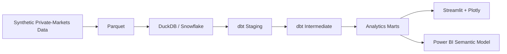
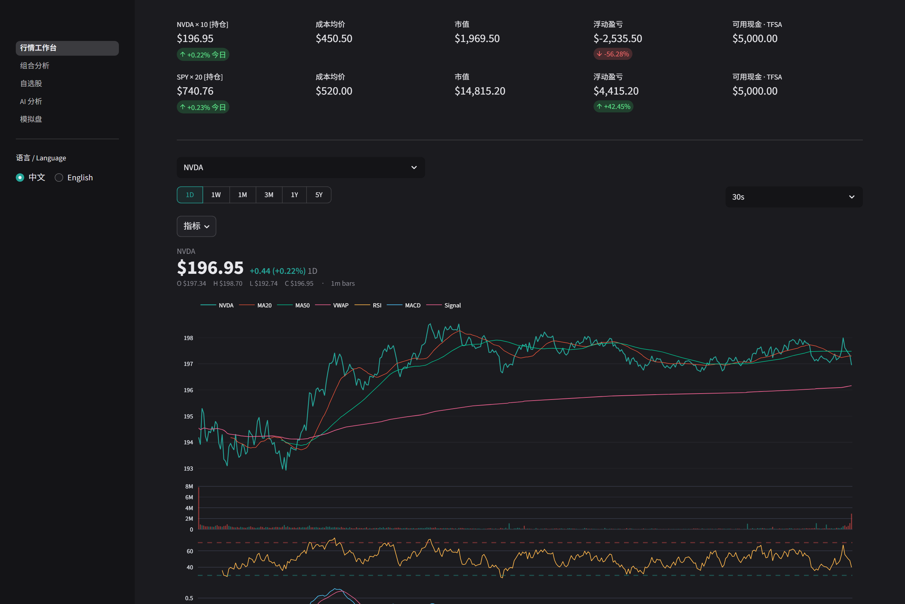
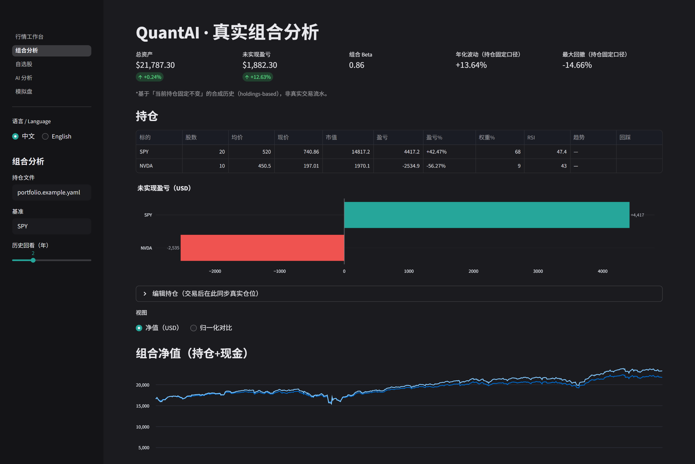
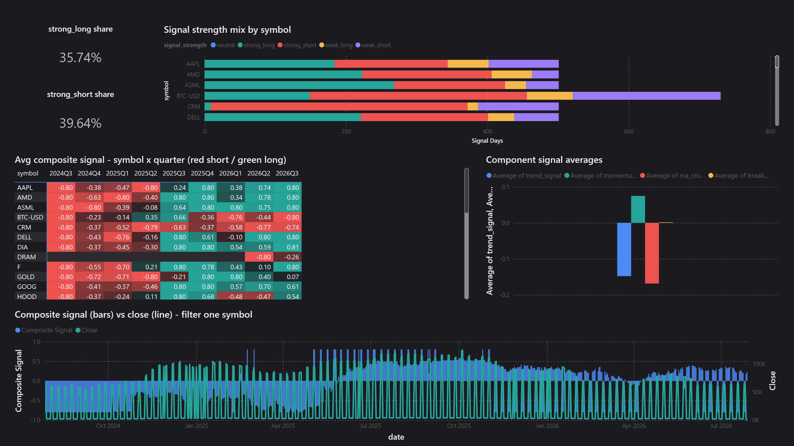

# LP Lens — Private Markets Fund Performance Analytics

LP Lens is an end-to-end private-markets analytics platform for Limited Partners (LPs), built to
model fund commitments, capital calls, distributions, NAV, and institutional fund-performance
metrics through a reproducible analytics pipeline.

Built with **Python, dbt, DuckDB, Streamlit, Plotly, and a Snowflake-ready architecture**, the
platform transforms synthetic LP × fund data into analytics-ready marts and interactive
private-markets analysis.

> All fund, manager, investor, portfolio, cash-flow, NAV, and performance data in this repository
> is synthetic.

Repository: [tkaushik015/private-markets-bi](https://github.com/tkaushik015/private-markets-bi)

## Overview

LP Lens models how an institutional LP evaluates a book of private-market funds. A seeded
generator produces position-level cash flows and NAV. dbt builds a star schema on DuckDB (and
the same models are written for Snowflake). Streamlit reads the performance marts through a
SELECT-only query layer.

Business logic lives in the warehouse. The dashboard does not recompute TVPI, DPI, RVPI, net IRR
or KS-PME. Power BI is a scaffold only; Streamlit is the implemented front end.

The committed demo warehouse `app/data/demo.duckdb` is enough to run the dashboard locally. No
Snowflake account is required to explore the application.

## What LP Lens Does

- LP portfolio analytics (ratio of sums / pooled IRR, not averages of fund ratios)
- LP × fund position analytics
- Commitments, paid-in capital, unfunded commitment, distributions and NAV
- TVPI, DPI, RVPI, net IRR and KS-PME
- J-curve analysis against fund age
- Vintage-year and strategy comparison at the position grain
- Fund, manager and LP exploration with quarterly history
- Seeded synthetic data generation
- dbt dimensional modelling on DuckDB, with Snowflake targets designed in-repo
- Automated tests and GitHub Actions CI

## Architecture



DuckDB is the default engine and the only one CI runs. Snowflake targets
(`snowflake_dev`, `snowflake_ci`, `snowflake_prod`) compile the same models via
`adapter.dispatch`. Those targets have not been run against a real account.

Streamlit and the (scaffolded) Power BI model consume
`fct_fund_performance_quarterly` and `fct_portfolio_performance_quarterly`. IRR and PME are
solved once in `src/lp_lens/metrics/returns.py` and imported by the dbt Python models. There is
no second implementation in SQL, DAX or the app.

## Data Model

Staging views rename and cast only. Intermediate models convert currency, build the quarter
spine and compute returns. Marts are tables with enforced contracts. Row counts are from a
DuckDB build of the seeded generator in `configs/generator.yaml`.

| Mart | Grain | Rows |
|---|---|---:|
| `dim_manager` | one row per GP | 25 |
| `dim_fund` | one row per fund | 60 |
| `dim_investor` | one row per LP | 12 |
| `dim_strategy` | one row per strategy | 7 |
| `dim_date` | one calendar day (`is_quarter_end` flagged) | 5,295 |
| `fct_cash_flows` | one cash flow | 3,078 |
| `fct_nav_quarterly` | fund × investor × quarter end | 4,454 |
| `fct_fund_performance_quarterly` | fund × investor × as-of quarter | 4,454 |
| `fct_portfolio_performance_quarterly` | investor × as-of quarter | 656 |

`fct_fund_performance_quarterly` is a point-in-time series. `is_latest_quarter` marks the
current row per position (156 rows as of 2026-06-30). Portfolio facts are aggregated from cash
flows and NAV, not from averaging fund-level ratios, so a liquidated fund still sits in the
investor's inception-to-date totals.

Formula docs: [`warehouse/models/marts/schema.yml`](warehouse/models/marts/schema.yml) and
[`warehouse/models/marts/_metric_definitions.md`](warehouse/models/marts/_metric_definitions.md).

## Synthetic Dataset

Private-markets position data is not public at LP grain, so LP Lens generates a seeded book.
The same seed and config produce byte-identical Parquet. Output lands in `data/raw/`
(gitignored).

| Dataset | Rows |
|---|---:|
| Managers | 25 |
| Funds | 60 |
| Investors | 12 |
| LP × fund positions | 156 |
| Cash-flow transactions | 3,078 |
| Quarterly NAV observations | 4,454 |
| Strategies | 7 |
| FX rates (date × pair) | 5,295 |
| Public index (date × index) | 5,295 |

Cash flows are irregular; NAV is a regular quarterly grid. Both are keyed on an LP × fund pair.
Amounts are unsigned; `flow_type` carries direction. NAV is derived from cumulative paid-in and
distributions so young funds trace a J-curve. Entities, sign convention and invariants:
[`src/lp_lens/generate/README.md`](src/lp_lens/generate/README.md).

## Private Markets Metrics

Every metric is **inception-to-date as at `as_of_quarter`** and **net of management fees**.
Carried interest is not in the source data, so these figures are not net of carry. An
uncomputable value is NULL, not 0.

| Metric | Meaning |
|---|---|
| Commitment | Capital committed by an LP to a fund, converted at the commitment-date FX rate |
| Paid-in | Capital calls and management fees contributed |
| Unfunded | Remaining callable commitment (commitment + recallable distributions − paid-in) |
| Distributions | Capital returned to the LP |
| NAV | Remaining quarter-end investment value |
| DPI | Distributions / paid-in |
| RVPI | NAV / paid-in |
| TVPI | (Distributions + NAV) / paid-in, equal to DPI + RVPI |
| Net IRR | XIRR of LP cash flows plus residual NAV. Actual/365. NULL if no sign change or the solver does not converge |
| KS-PME | Kaplan-Schoar public market equivalent against the synthetic total-return index |

Portfolio TVPI is a **ratio of sums**, not an average of fund TVPIs. Portfolio IRR is solved
over **pooled portfolio cash flows**, not an average of fund IRRs. Paid-in of zero yields NULL
multiples.

Latest-quarter medians from `fct_fund_performance_quarterly` where `is_latest_quarter`, as of
**2026-06-30**. Medians of 156 positions, not AUM-weighted.

| Strategy | Positions | Median TVPI | Median net IRR |
|---|---:|---:|---:|
| Buyout | 60 | 1.435 | 7.80% |
| Growth | 24 | 2.213 | 16.04% |
| Infrastructure | 9 | 1.125 | 1.91% |
| Private Credit | 13 | 1.197 | 5.45% |
| Real Estate | 12 | 1.650 | 10.97% |
| Secondaries | 24 | 1.098 | 3.21% |
| Venture | 14 | 2.042 | 13.26% |
| All positions | 156 | 1.270 | 6.19% |

## Streamlit Application

Five pages, all SELECT-only against the performance marts via `src/lp_lens/query/`.

| Page | Purpose |
|---|---|
| Portfolio Overview | LP-level commitment, paid-in, unfunded, NAV, TVPI, DPI and net IRR |
| Vintage & Strategy | Compare positions across fund vintages and strategies |
| J-Curve | TVPI, DPI and RVPI against fund age |
| Fund Explorer | Funds, managers, LP positions and quarterly history |
| Metric Definitions | `` blocks from the warehouse metric YAML |

Every page shows the mart as-of date. Young funds sit below 1.0x TVPI because fees are paid in
before residual value has accrued. The footer prints the active source, dbt `generated_at` and
the git SHA.

The default source is the committed file `app/data/demo.duckdb`. Snowflake and a local dbt
build are not required to explore the app. Set `LP_LENS_APP_SOURCE=snowflake` only after a real
Snowflake load (that load has not been run from this work).

Power BI remains an empty PBIP scaffold ([`powerbi/README.md`](powerbi/README.md)).

## Technology Stack

| Layer | Technology |
|---|---|
| Language | Python |
| Generation | Pandas, NumPy, Pydantic |
| Storage | Parquet |
| Local warehouse | DuckDB |
| Cloud warehouse | Snowflake (designed, not deployed) |
| Transformation | dbt |
| Returns | SciPy (`xirr` / KS-PME in `lp_lens.metrics.returns`) |
| Dashboard | Streamlit, Plotly |
| Tests | Pytest, SQLFluff, Ruff, pre-commit |
| CI | GitHub Actions |
| BI | Power BI project scaffold |

## Running LP Lens

```bash
git clone https://github.com/tkaushik015/private-markets-bi.git
cd private-markets-bi
python -m venv .venv && source .venv/bin/activate
pip install -e ".[warehouse,app,dev]"
streamlit run app/streamlit_app.py
```

The app opens at `http://localhost:8501` and reads `app/data/demo.duckdb`.

To publish on Streamlit Community Cloud (not published from this work): main file
`app/streamlit_app.py`, requirements `app/requirements.txt`, Python 3.12, no Snowflake
secrets on a public app.

## Rebuilding the Pipeline

```bash
python -m lp_lens.generate --config configs/generator.yaml --out data/raw

export LP_LENS_RAW_DIR=data/raw
export LP_LENS_DB_PATH=data/warehouse/lp_lens.duckdb
dbt build --project-dir warehouse --profiles-dir warehouse --target local
pytest

python app/export_demo_warehouse.py
streamlit run app/streamlit_app.py
```

## Snowflake Architecture

Objects, load path and dbt targets are in the repository. They have **not** been applied to a
real Snowflake account from this work. No load, dbt-on-Snowflake or DuckDB-vs-Snowflake
reconcile has been measured.

Designed layout:

```text
LP_LENS_DEV / LP_LENS_PROD
  RAW | STAGING | INTERMEDIATE | MARTS

LP_LENS_LOADER        write RAW
LP_LENS_TRANSFORMER   read RAW, write the rest
LP_LENS_REPORTER      SELECT on MARTS only
```

One X-Small warehouse, `AUTO_SUSPEND = 60`, resource monitor `LP_LENS_RM` at 20 credits per
month (notify 80%, suspend 100%). Credentials are environment variables and key-pair auth only.
`sfconn.mask` strips the account identifier and key path from errors.

After ACCOUNTADMIN applies `infra/snowflake/setup.sql`:

```bash
cp .env.snowflake.example .env.snowflake.local
python infra/snowflake/load_raw.py --raw-dir data/raw --env-file .env.snowflake.local --stage-wheel
export LP_LENS_SNOWPARK_WHEEL=@LP_LENS_DEV.RAW.LP_LENS_PACKAGES/lp_lens-0.1.0-py3-none-any.whl
dbt build --project-dir warehouse --profiles-dir warehouse --target snowflake_dev
python infra/snowflake/reconcile.py --duckdb data/warehouse/lp_lens.duckdb --schema marts --env-file .env.snowflake.local
```

The slim metrics wheel (`infra/snowflake/build_metrics_wheel.py`) packages
`src/lp_lens/metrics/returns.py` only. End-to-end Snowpark execution is designed, not deployed.

DuckDB-only negative control (no Snowflake):

```bash
python infra/snowflake/reconcile.py --negative-control --duckdb data/warehouse/lp_lens.duckdb
```

## Testing & CI/CD

Pytest covers generator invariants, return math, mart reconciliation against pandas, the
Streamlit query layer (no Streamlit import) and Snowflake infrastructure scripts. SQLFluff
lints compiled dbt SQL. Ruff and pre-commit gate the same checks locally.

```bash
pytest
```

`.github/workflows/ci.yml` runs on pull requests and on pushes to `main`:

```text
synthetic data  →  SQL lint  →  dbt build (DuckDB)  →  pytest
```

CI does not connect to Snowflake.

## Project Origins & Upstream Inspiration

LP Lens began from the MIT-licensed
[C0k11/quantai](https://github.com/C0k11/quantai) project.

QuantAI is a public-equities analytics and decision-support platform.
LP Lens changes the analytical domain to **private-market fund
performance**, replacing securities, market prices, trading signals and
backtesting with funds, LP commitments, irregular cash flows, NAV,
J-curves and institutional private-markets performance metrics.

The screenshots below show the **original upstream QuantAI project**.
They are retained here only to document the engineering and interface
reference that influenced this work.

| Original QuantAI Streamlit Workstation | Original QuantAI Portfolio |
|---|---|
|  |  |

| Original QuantAI Power BI Overview | Original QuantAI Signals Analysis |
|---|---|
|  |  |

> **Upstream reference:** The four images above are screenshots of
> `C0k11/quantai`, not screenshots of LP Lens. They are reproduced from
> the MIT-licensed upstream project for attribution and historical
> reference.

LP Lens introduces a different domain model, synthetic data generator,
private-markets metrics layer, analytics warehouse, and Streamlit
application.

For detailed file-level provenance, see
[`ATTRIBUTION.md`](ATTRIBUTION.md).

The first commit on `main` is the unmodified upstream tree
(`c68587f`). A diff from that commit is the complete record of what
this project added.

## Implementation Status

| Component | Status |
|---|---|
| Synthetic private-markets generator | Implemented |
| DuckDB warehouse | Implemented |
| dbt staging layer | Implemented |
| dbt intermediate layer | Implemented |
| Analytics marts | Implemented |
| Fund-performance metrics | Implemented |
| Portfolio-performance metrics | Implemented |
| Streamlit dashboard | Implemented |
| Automated testing | Implemented |
| GitHub Actions CI | Implemented |
| Snowflake architecture | Implemented / not deployed |
| Power BI semantic model | Designed / scaffolded |
| Public Streamlit deployment | Not yet published |

## Data Disclaimer

All fund, manager, investor, portfolio, cash-flow, NAV and performance data in this repository
is **synthetic**. No value represents an actual fund, manager, institutional investor or
reported return. The project is for engineering, analytics and demonstration.

## Attribution

This repository began from [C0k11/quantai](https://github.com/C0k11/quantai) (MIT). Engineering
patterns that were kept — and every change to those files — are listed in
[ATTRIBUTION.md](ATTRIBUTION.md). The domain layer is original: funds, commitments, cash flows
and NAV, not public equities.

[`docs/AUDIT.md`](docs/AUDIT.md) is the pre-work audit of the inherited tree.

## Author

**Tushar Kaushik**

M.S. Applied Data Science<br>
University of Southern California

[LinkedIn](https://www.linkedin.com/in/tushar-kaushik-493a8115a/)

## License

MIT. See [LICENSE](LICENSE), which retains the original QuantAI copyright notice and this
project's copyright notice.
