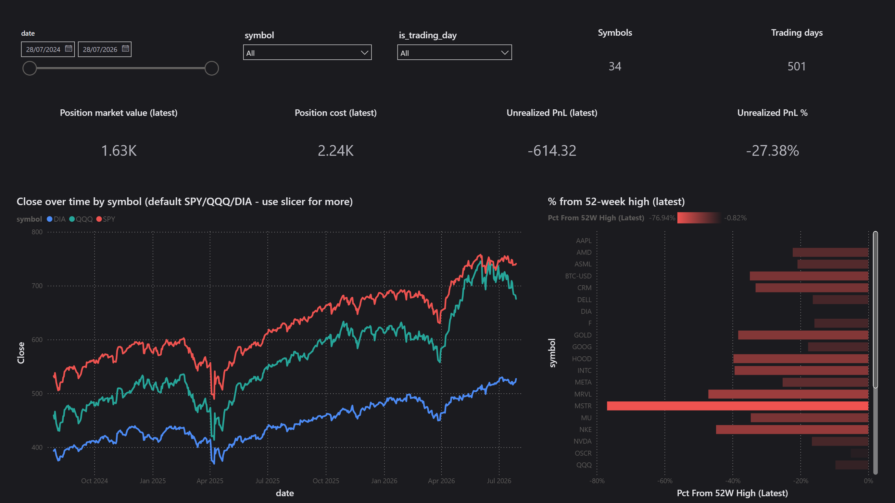
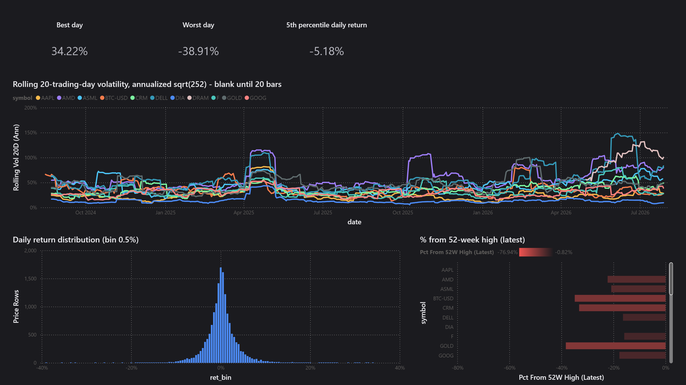
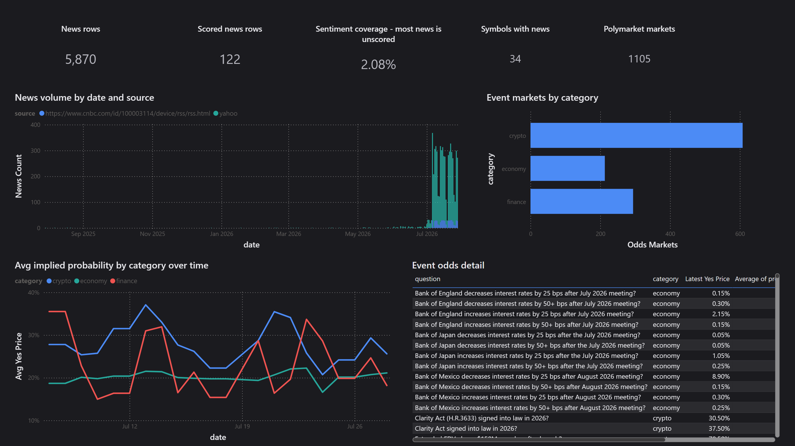
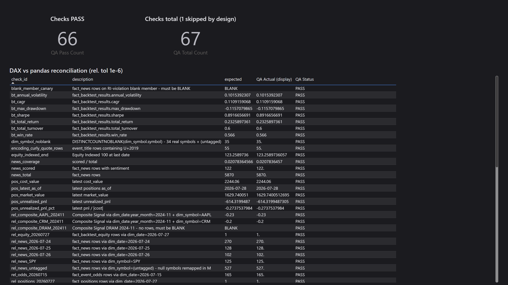
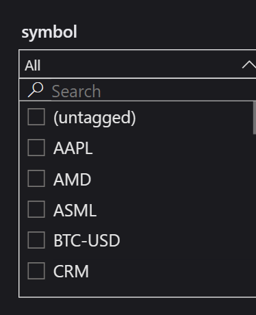

# QuantAI Portfolio Analytics - Power BI (BI as code)

A five-page (plus hidden QA) Power BI implementation of the dashboard
specification in [`SPEC.md`](SPEC.md), over the CSV star schema exported from
the QuantAI DuckDB warehouse.

The spec was first drafted in Tableau's table-calculation vocabulary
(`WINDOW_STDEV` / `WINDOW_AVG`); no workbook was ever built - Power BI is the
sole implementation, under one working principle: **spec unchanged, engine
swapped, results reconciled**. The semantic model is
plain-text TMDL and the report layout is generated by
[`build_report.py`](build_report.py) - the whole BI artifact diffs in git.

| Piece | File(s) |
|---|---|
| PBIP project entry | `QuantAI.pbip` (open in Power BI Desktop, free) |
| Semantic model (TMDL) | `QuantAI.SemanticModel/definition/**` - 10 tables, 11 relationships, all measures |
| Report layout (generated) | `QuantAI.Report/report.json` <- regenerate with `python powerbi/build_report.py` |
| Theme | `theme/quantai-dark.json` (#1B1B1F / #4C8BF5 / #26A69A / #EF5350) - same design tokens as `quantai/ui/theme.py` and `.streamlit/config.toml`; JSON has no comment syntax, so the sync rule lives here: **change one, change all three** |
| Reconciliation | `verify/verify_dax.py` -> `verify/expected_values.csv` (67 checks) |
| Screenshots | `img/page1...page6.png` (cropped to the 1600×900 canvas) + slicer proof |

## Open / refresh

1. `python scripts/warehouse.py --export` regenerates `data/exports/*.csv`
   (gitignored - the PBIP stores no data; open on a fresh machine requires this
   step first).
2. Open `QuantAI.pbip` in Power BI Desktop (free; Store build 2.156 verified).
   On another machine change the two Power Query parameters `ExportFolder` /
   `VerifyFolder` - every query reads through them.
3. Click **Refresh now** on the banner. CSV import is pinned to
   **65001 UTF-8** in every query; the QA page carries an encoding canary
   (55 `event_title` rows must contain the curly quote U+2019 - if that check
   fails, an import regressed to a legacy codepage).

Desktop will offer to save on close - saving re-serializes the hand-written
TMDL (comments are lost, `lineageTag`s added). Harmless, but for clean diffs
treat Desktop as read-only and let the text files be the source of truth.

## The technical core: window table calcs -> DAX

The spec's rolling measures are Tableau-style **table calculations** - they
address rows of the rendered view. DAX has no such concept; the window must be rebuilt
from the data. Three semantic points, each of which silently produces
plausible-but-wrong numbers if missed:

1. **The window is 20 trading rows, not 20 calendar days.** Translating
   `WINDOW_STDEV(..., -19, 0)` as `DATESINPERIOD(-20, DAY)` is the natural and
   wrong move. Measured on the 2026-07-27 export (SPY, last date 2026-07-27): the
   20 trading rows span **28 calendar days**; a 20-calendar-day window keeps
   only **14 samples** and reads annualized vol **0.1016 vs 0.1132** - about
   **10% low**, with nothing visibly wrong on the chart. The DAX therefore
   takes `TOPN(20, ...)` over the symbol's actual bar dates.
2. **`WINDOW_STDEV` is the sample standard deviation** -> `STDEVX.S`
   (pandas `ddof=1`), not `STDEVX.P`.
3. **A short window returns BLANK** - `IF(COUNTROWS(w) = 20, ...)` - matching
   the spec's empty-cell rule instead of quietly computing a 5-bar "volatility".

`MA 20/50/200` follow the same trading-row pattern; the benchmark-vs-strategy
lines are indexed to 100 anchored on the backtest calendar
(`fact_backtest_equity[date]`), so both series share the same 500-trading-day
axis.

## Layout

The canvas is **1600×900**; all coordinates in `build_report.py` are written on
a 1280×720 design grid and scaled by a module-level constant `S = 1.25` at emit
time - resizing the whole report is a two-line change. Cards render the value
at 20pt (16pt for the narrow six-across row) with **category labels off** (the
title already names the number) and 12pt titles; the symbol and trading-day
slicers are dropdowns (34 items never fit a list); the signals matrix is
**symbol × quarter** (25 month columns needed a scrollbar, 9 quarters fit on
one screen); Page 1 dropped its bottom detail table (every column already
appears in the page's charts) so the two main charts get the lower half.

## Verification: DAX vs pandas, 67 checks in two classes

`verify/verify_dax.py` computes every expected value from the same CSVs. The
hidden **QA page** joins them against the live DAX measures and verdicts each
row at **relative tolerance 1e-6**.

**Class 1 - measure arithmetic** (53 checks): row counts ×10, SPY rolling vol
and MA20/50/200 on the last five trading days, both indexed series at range
end, all seven backtest metrics, the four latest-position numbers, the five
signal-strength buckets, news sentiment coverage, and the UTF-8 canary.

**Class 2 - model wiring** (14 checks): 11 relationship-propagation checks
filter a *dimension* value and count/aggregate the *fact* through the model
relationship - no `REMOVEFILTERS` on the dimension allowed. One check per
relationship, plus `Composite Signal` for DRAM in 2024-11 which **must be
BLANK** (the symbol has no rows that month - a filled cell means a dead join
is broadcasting全期 values). This class exists because the first review proved
Class 1 alone cannot detect a dead relationship: every Class-1 check is a row
count, a single-row scalar, or a windowed measure that re-filters fact columns
itself, so **all 53 passed while every date relationship was broken**.
Three further checks pin the blank-member fix (next section): the `(untagged)`
row count (527 on the current export), `DISTINCTCOUNTNOBLANK(dim_symbol[symbol])` (35), and a canary
that counts fact_news rows attached to the RI-violation blank member (**must
be BLANK** - any future unmatched symbol value turns it red).

Result on 2026-07-28 (data at the 07-28 close, exports under `data/exports`):
**66 / 67 PASS, 1 SKIPPED by design**
(`fact_trades.csv` has 0 rows and is deliberately not loaded).

## Foreign-key nulls and the `(Blank)` slicer member

A full FK null scan **without `.dropna()`** (the original spec's "referential
integrity is clean" claim came from a `dropna()`-poisoned check): every date
key and every symbol key is 0-null **except `fact_news.symbol` - 527 of 5,870
rows are null** (news not attributable to one ticker). Once `symbol_to_news`
went live, those rows matched nothing in `dim_symbol` and Power BI
manufactured a `(Blank)` member that led every slicer. Fix, in M: null/empty
symbols are remapped to **`(untagged)`** at import, and `dim_symbol` appends
the matching row (its model row count is therefore **35 = 34 CSV rows + 1**,
which the `rowcount_dim_symbol` check now expects). The untagged news rows keep
their real meaning ("not tied to a symbol") instead of hiding in a blank.

One test-design note: the obvious check `DISTINCTCOUNT(dim_symbol[symbol]) =
35` **cannot catch a regression** - the virtual blank row that an RI violation
adds is itself counted, so broken (34 real + 1 blank) and fixed (35 real) both
return 35, green forever. Hence the `DISTINCTCOUNTNOBLANK` + blank-member
canary pair above.

**Negative verification**: with the six date relationships and
`fact_news.symbol` deleted from the TMDL, the 11 Class-2 checks were re-run -
**11 / 11 FAIL** (counts return the full table, DRAM returns the whole-period
mean instead of BLANK), and the price lines flatten to whole-period averages
on the canvas. Relationships restored -> 63/64 green again. The suite provably
turns red when the wiring breaks.

Seven DAX/model/report bugs were caught live by this loop:

- a measure reference inside a `CALCULATE` boolean filter (`PLACEHOLDER`
  error) -> capture with `VAR` first;
- `SELECTEDVALUE` returning BLANK on a single-row table in query context ->
  `MAX` is the robust scalar for a 1-row table;
- `REMOVEFILTERS(t1, t2)` - multiple *table* arguments are not allowed ->
  split into two calls;
- windowed measures going flat when the visual axis is a fact-table column
  that `ALLSELECTED(dim_date)` cannot see -> anchor `CurDate`/`StartDate` on
  the axis table itself;
- windowed measures returning NaN/garbage once date relationships went live -
  the inner per-window-row `CALCULATE` must also `REMOVEFILTERS(dim_date)`,
  otherwise an axis/slicer date intersects the window rows away. **The old
  form had passed QA only because the relationships were dead** - fixing the
  wiring exposed the arithmetic bug, which is exactly why both check classes
  must exist;
- `[QA Pass Count]` erroring inside the card's `SUMMARIZECOLUMNS` query plan
  (`FILTER` over a measure with context transition) -> `SUMX ... IF` form;
- the matrix cell-background gradient **silently not rendering** although its
  FillRule JSON was schema-perfect: matrix *Cell elements* formatting is
  field-scoped, so the `objects.values` entry must carry
  `"selector": {"data": [wildcard], "metadata": "_Measures.<measure>"}` - a
  pure `dataViewWildcard` selector (which the bar chart's `dataPoint` fill
  happily accepts) is ignored by the matrix renderer. Found by GUI round-trip:
  applied once by hand, saved, diffed - the only delta was the `metadata` key
  (and `nullColoringStrategy: 'noColor'` in place of the bar's `'asZero'`
  family). Caught late because the earlier "gradient done" claim was verified
  by eye on a bar chart but never pixel-checked on the matrix; a fresh-reload
  render test from pure generated config now passes.

## The relationship failure, root-caused

Symptom: matrices showed each symbol's whole-period average in every month,
line charts drew flat means, cells that should be BLANK were filled. The six
`dim_date ->` relationships (and `fact_news.symbol`) did not exist in the
model, while four others worked. Diagnosis and mechanism:

1. Hand-written relationships loaded from TMDL enter a **"needs manual
   refresh"** state - a dedicated banner with its own *Refresh now* button.
   That button was never clicked during the original build (the data banner's
   button was, repeatedly). The pending relationships were then silently
   dropped across save/close cycles.
2. On data refresh Desktop's **autodetect** re-created relationships between
   same-named string columns (`symbol`, `run_id`) - masking the loss and
   producing the "symbol works / date dead" asymmetry. The autodetected
   `fact_backtest_results 1:1 dim_symbol` ghost (never in the TMDL) was the
   giveaway, and was deleted.
3. Repair, per review instructions, used **Desktop's own round-trip
   serialization as the authority**: one relationship built by hand in the
   GUI, saved, diffed, then the six missing ones re-added in exactly that
   syntax and processed via the relationship banner. Model view now shows 11.
4. A second trap found on the way: the ribbon *Refresh* control is a
   **dropdown** - clicking it opens a menu and refreshes nothing until
   *Schema and data* is chosen. One earlier "all green" reading is void
   because `qa_expected` had silently stayed on the previous 53-row CSV;
   verified now by asserting `COUNTROWS(qa_expected) = 64` before reading
   any verdicts.

## Honest limitations

- **Free Desktop only**: no Publish-to-web / Service workspace, so the
  deliverable is the PBIP + screenshots; a reviewer reproduces by opening the
  project locally.
- The latest positions snapshot holds **one symbol (SPCX)** - the portfolio
  section is KPI cards, not weight charts; that is the data, not a rendering
  gap. Position figures are the author's real (small) holding, kept as-is so
  every reconciliation number traces to source data. No account identifiers
  are included.
- `fact_news.sentiment` covers **122 of 5,870 rows (2.08%)** - the coverage is
  printed on the News page as a card, and no average is presented as a
  population statement.
- The combo chart needs a single symbol selected to be readable (noted in its
  title). The close-price line defaults to SPY/QQQ/DIA via a generated
  visual-level filter; the 52-week bars and the signals matrix carry diverging
  conditional-format scales (both FillRule schemas recovered from Desktop's
  own serialization - the bar's needs a `dataViewWildcard` selector, the
  matrix additionally a `metadata` field selector, see the bug list above).
- `is_trading_day` is a slicer, not a global filter - filtering it would drop
  BTC-USD's 231 weekend bars.
- Report layout uses the classic `report.json` format (stable, text,
  generator-friendly) rather than the PBIR preview format; the semantic model
  uses TMDL, which round-trips in Desktop 2.156 without preview switches.

## Screenshots

| Page | |
|---|---|
| Market Overview |  |
| Signals |  |
| Backtest vs Benchmark |  |
| Risk & Volatility |  |
| News & Event Odds |  |
| QA (hidden) |  |
| Symbol slicer - `(untagged)` present, no `(Blank)` |  |
